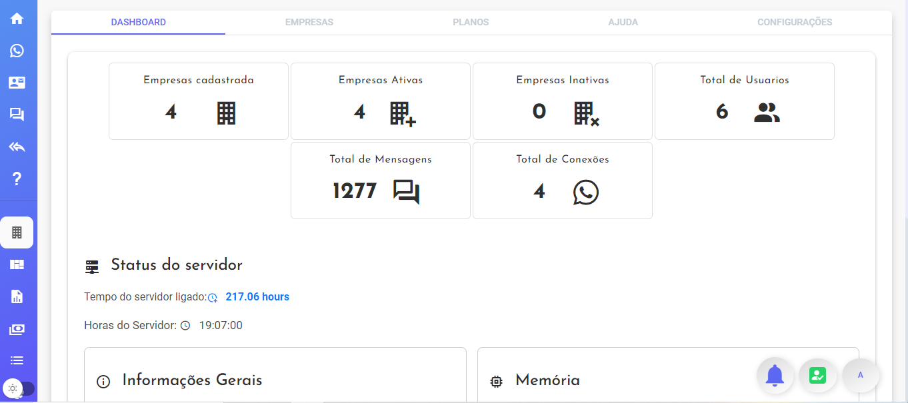
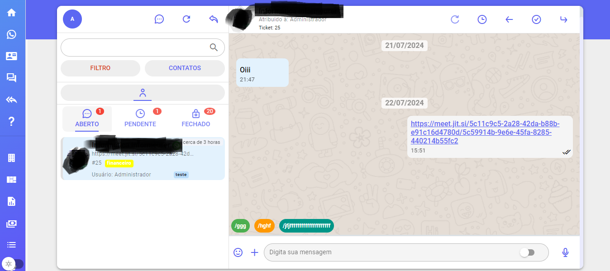
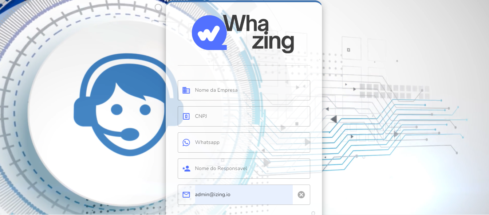

# Whazing SaaS

Um sistema para gestão de atendimento multicanais centralizado.

Esta versão foi trocada pela api [@whiskeysockets/baileys](https://github.com/WhiskeySockets/Baileys)

Acesso instagram funcional somente use servidor no Brasil pois usa instagram web

Novos recursos
- Painel SaaS
- Chat Interno
- Solicitar teste na pagina de login, e função esqueci a senha
- Planos
- Menu Ajuda
- Integração bancaria recebimento PIX, verificar docs

Dados de Acesso

admin@admin.com
123456


**IMPORTANTE**: 
Versão grátis disponivel nesse repositorio*

- Limite 10 usuários e 2 canais


Versão Premium

-Não posso possui limites

Essa versão ja está codigo inicial (webhook) para validar licença.
*Durante a fase beta os recursos premium estaram liberados para todos


## Screenshots
> 
___  
>
___

>
___


 
## Instalando
Seguem links sugerimos:

-  [Como Instalar o Whazing VPS - Texto - UBUNTU 20, 22](docs/INSTALL_VPS_UBUNTU_20_22.md)

-  [Instalador automatico](https://github.com/cleitonme/Whazing-SaaS.instalador)
<br/>


## Recomendação de VPS boa e barata

-  [Powerful cloud VPS & Web hosting.](https://control.peramix.com/?affid=58)

- Cupom 25% desconto "WHAZING"

```bash
WHAZING
```

## Consultoria particular

Para quem gostaria de uma consultoria ou que eu faça instalação pode chamar no whatsapp (será cobrado por isso) 48 999416725

Acesso pasta SRC pode chamar no whatsapp (será cobrado por isso) 48 999416725
