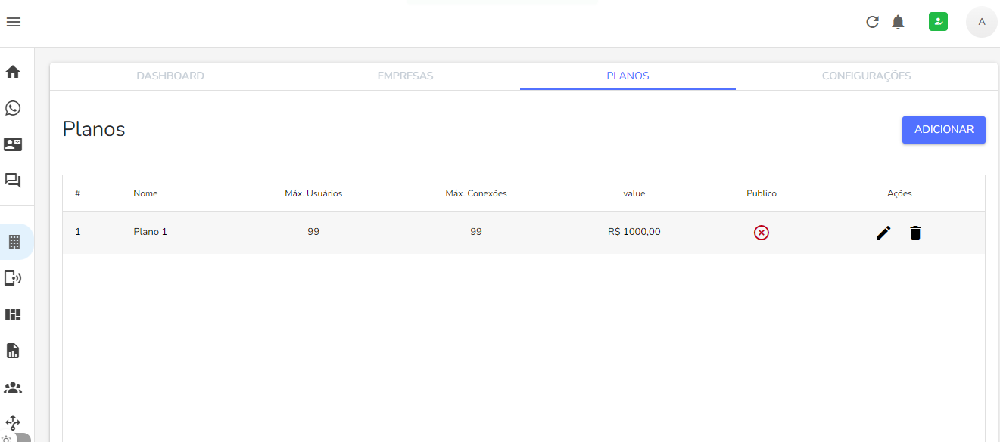
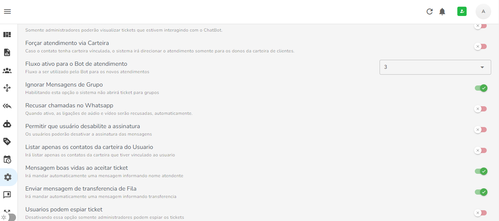

# Whazing SaaS

Um sistema para gestão de atendimento multicanais centralizado.

Esta versão foi trocada pela api [@whiskeysockets/baileys](https://github.com/WhiskeySockets/Baileys)

Acesso instagram funcional somente use servidor no Brasil pois usa instagram web

Novos recursos
Chat Interno
Solicitar teste na pagina de login

Dados Acesso

admin@admin.com
123456

**IMPORTANTE**: não garantimos que a utilização desta ferramenta não irá gerar bloqueio nas contas utilizadas. São bots que em sua maioria utilizam APIs segundarias para comunicação com os fornecedores dos serviços. Use com responsabilidade!

## Screenshots
> 
___  
>
___

>
___

## Principais funcionalidades

- Multíplos canais de atendimento ✅
- Multíplos usuários simultâneos por canais de atendimento ✅
- Iniciar conversa com contatos existentes (whatsapp) ✅
- Construção de Chatbot interativo ✅
- Enviar e receber mensagens ✅
- Enviar e receber mídias diversas (imagens/áudio/documentos) ✅
- Multiempresas (abordagem de base compartilhada)

  
## Instalando
Seguem links sugerimos:

-  [Como Instalar o Whazing VPS - Texto - UBUNTU 20, 22](docs/INSTALL_VPS_UBUNTU_20_22.md)

-  [Instalador automatico](https://github.com/cleitonme/Whazing-SaaS.instalador)
 

## Recomendação de VPS boa e barata

-  [Powerful cloud VPS & Web hosting.](https://control.peramix.com/?affid=58)

## Consultoria particular

Para quem gostaria de uma consultoria ou que eu faça instalação pode chamar no whatsapp (será cobrado por isso) 48 999416725

Acesso pasta SRC pode chamar no whatsapp (será cobrado por isso) 48 999416725