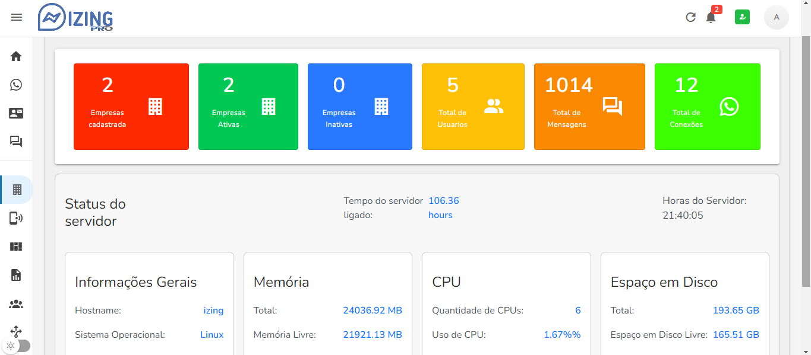
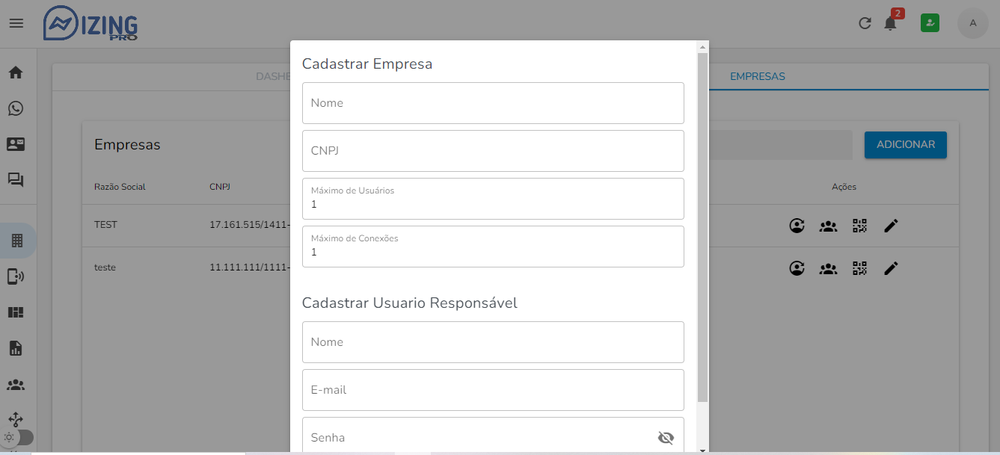

# Izing Pro

Um sistema para gestão de atendimento multicanais centralizado.

Esta versão foi trocada pela api [@whiskeysockets/baileys](https://github.com/WhiskeySockets/Baileys)

Novos recursos
Chat Interno


**IMPORTANTE**: não garantimos que a utilização desta ferramenta não irá gerar bloqueio nas contas utilizadas. São bots que em sua maioria utilizam APIs segundarias para comunicação com os fornecedores dos serviços. Use com responsabilidade!


## Screenshots
> 
___  
>
___

## Principais funcionalidades

- Multíplos canais de atendimento ✅
- Multíplos usuários simultâneos por canais de atendimento ✅
- Iniciar conversa com contatos existentes (whatsapp) ✅
- Construção de Chatbot interativo ✅
- Enviar e receber mensagens ✅
- Enviar e receber mídias diversas (imagens/áudio/documentos) ✅
- Multiempresas (abordagem de base compartilhada)

  
## Instalando
Seguem links sugerimos:

-  [Como Instalar o IZING VPS - Texto - UBUNTU 20, 22](docs/INSTALL_VPS_UBUNTU_20_22.md)

-  [Instalador automatico](https://github.com/cleitonme/izingpro.bayles.install)
<br/>

## Atualizando

Izing é um trabalho em progresso e estamos frequentemente adicionando novas funcionalidades e correções de bugs.

**IMPORTANTE**: verifique sempre o .env.example e ajuste o seu .env antes de atualizar, uma vez que algumas novas variáveis podem ser adicionadas.

```bash
nano updateIzing
```

```bash
#!/bin/bash
echo  "Atualizando izing, aguarde..."
cd  ~
cd izing
git pull
cd backend
npm install
npx sequelize db:migrate
#npx sequelize db:seed
cd ../frontend
npm install
export NODE_OPTIONS=--openssl-legacy-provider
quasar build -P -m pwa
pm2 restart all

echo  "Atualização finalizada!"
```

Marque o arquivo como executável:

```bash
chmod +x updateIzing
./updateIzing
```

## FIQUE ATENTO

A utilização desta ferramenta é feita por sua conta e risco. O código é aberto e todos podem contribuir. Espero que não (rsrrs), mas podem existir bugs e problemas de segurança.

Este projeto não é afiliado, associado, autorizado, endossado por, ou de qualquer forma oficialmente ligado à WhatsApp, ou a qualquer uma das suas filiais ou afiliadas. O website oficial da WhatsApp pode ser encontrado em https://whatsapp.com. "WhatsApp", bem como nomes, marcas, emblemas e imagens relacionadas são marcas registadas dos seus respectivos proprietários.


# izing
